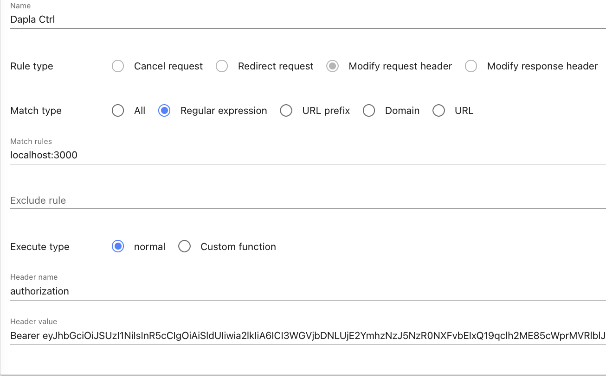

<a name="readme-top"></a>

<h1 align="center">Dapla Ctrl</h3>

  <p align="center">
    A web interface for performing administrative tasks related to Dapla teams.
    <br />
    <br />
    <a href="https://github.com/statisticsnorway/dapla-ctrl/issues">Report Bug</a>
    ·
    <a href="https://github.com/statisticsnorway/dapla-ctrl/issues">Request Feature</a>
  </p>
</div>

<!-- ABOUT THE PROJECT -->

## About The Project

[![Vite][Vite.js]][Vite-url]
[![React][React.js]][React-url]

A web interface for performing administrative tasks related to Dapla teams which
supports things like displaying Dapla team members, adding team members and creating new teams.

## Developing

In Dapla Ctrl we use [effect](https://effect.website) as the standard library for typescript as it bring with it some
powerful primitives for managing asynchrounous effects in a sane way with strong observability support. Furthermore, it provides schema validation for data and a complete set of funmany handy utilityctions for manipulating data in an immutable manner. Prefer writing in a functional style using `effect` when developing Dapla Ctrl.

## Setup

1. Clone the repo using tools like `git clone` or `gh repo clone`.
2. Navigate into the repository root directory
   ```sh
   cd dapla-ctrl
   ```
3. Start the Nix development environment
   ```sh
   nix develop
   ```
4. Install PNPM packages
   ```sh
   pnpm install
   ```
5. Start the development server and access the application at http://localhost:3000
   ```sh
   pnpm run dev
   ```

### Note about local development

Dapla Ctrl assumes all requests include an authorization header when sending requests to the API. Therefore, when developing locally you will need to have a browser plugin that modifies the header with your bearer token. For example you can use [header editor](https://addons.mozilla.org/en-US/firefox/addon/header-editor) for firefox. Add a new rule which matches the URL for the development server and add an authorization header with `Bearer <token>`, don't forget the space between "Bearer" and the token.



### Tips

You can use [direnv](https://github.com/direnv/direnv) to automatically hook into your nix shell environment
when `cd`ing into the project's root directory. There also exists plugins like [direnv for vscode](https://marketplace.visualstudio.com/items?itemName=mkhl.direnv) for code editors to hook into this
environment as well.

If you don't want to use the Nix development environment you have to follow these extra manual steps:

- Install nodemon (required to run the development server)

  ```sh
  pnpm add -g nodemon
  ```

- Set environment variables needed by the application:

  ```sh
  touch .env.local && printf 'DAPLA_TEAM_API_URL=https://dapla-team-api.intern.test.ssb.no\nPORT=3000\nDAPLA_CTRL_ADMIN_GROUPS=dapla-stat-developers,dapla-skyinfra-developers,dapla-utvik-developers\nDAPLA_CTRL_DOCUMENTATION_URL=https://statistics-norway.atlassian.net/wiki/x/EYC24g' >> .env.local
  ```

### ESLint and Prettier

For ensuring code consistency and adhering to coding standards, our project utilizes ESLint and Prettier. To view linting warnings and errors in the console, it's recommended to run the following script during development:

```sh
pnpm run lint
```

To automatically fix linting and formatting issues across all files, you can use the following scripts (Note: While these scripts resolve many ESLint warnings or errors, some issues may require manual intervention):

```sh
pnpm run lint:fix && pnpm run lint:format
```

### IDE Support

For seamless integration with popular IDEs such as Visual Studio Code and IntelliJ, consider installing the following plugins:

#### Visual Studio Code

1. **ESLint**: Install the ESLint extension to enable real-time linting and error highlighting.
   [ESLint Extension](https://marketplace.visualstudio.com/items?itemName=dbaeumer.vscode-eslint)

2. **Prettier**: Enhance code formatting by installing the Prettier extension.
   [Prettier Extension](https://marketplace.visualstudio.com/items?itemName=esbenp.prettier-vscode)

#### IntelliJ

1. **ESLint**: Install the ESLint plugin to enable ESLint integration within IntelliJ.
   [ESLint Plugin](https://plugins.jetbrains.com/plugin/7494-eslint)

2. **Prettier**: Integrate Prettier for code formatting by installing the Prettier plugin.
   [Prettier Plugin](https://plugins.jetbrains.com/plugin/10456-prettier)

By incorporating these plugins into your development environment, you can take full advantage of ESLint and Prettier to maintain code quality and consistent formatting throughout your project.

<p align="right">(<a href="#readme-top">back to top</a>)</p>
 
<!-- MARKDOWN LINKS & IMAGES -->
<!-- https://www.markdownguide.org/basic-syntax/#reference-style-links -->

[contributors-shield]: https://img.shields.io/github/contributors/github_username/repo_name.svg?style=for-the-badge
[contributors-url]: https://github.com/github_username/repo_name/graphs/contributors
[forks-shield]: https://img.shields.io/github/forks/github_username/repo_name.svg?style=for-the-badge
[forks-url]: https://github.com/github_username/repo_name/network/members
[stars-shield]: https://img.shields.io/github/stars/github_username/repo_name.svg?style=for-the-badge
[stars-url]: https://github.com/github_username/repo_name/stargazers
[issues-shield]: https://img.shields.io/github/issues/github_username/repo_name.svg?style=for-the-badge
[issues-url]: https://github.com/github_username/repo_name/issues
[Vite.js]: https://img.shields.io/badge/Vite-2023A?style=for-the-badge&logo=vite&logoColor=61DAFB
[Vite-url]: https://vitejs.dev/
[React.js]: https://img.shields.io/badge/React-20232A?style=for-the-badge&logo=react&logoColor=61DAFB
[React-url]: https://reactjs.org/
