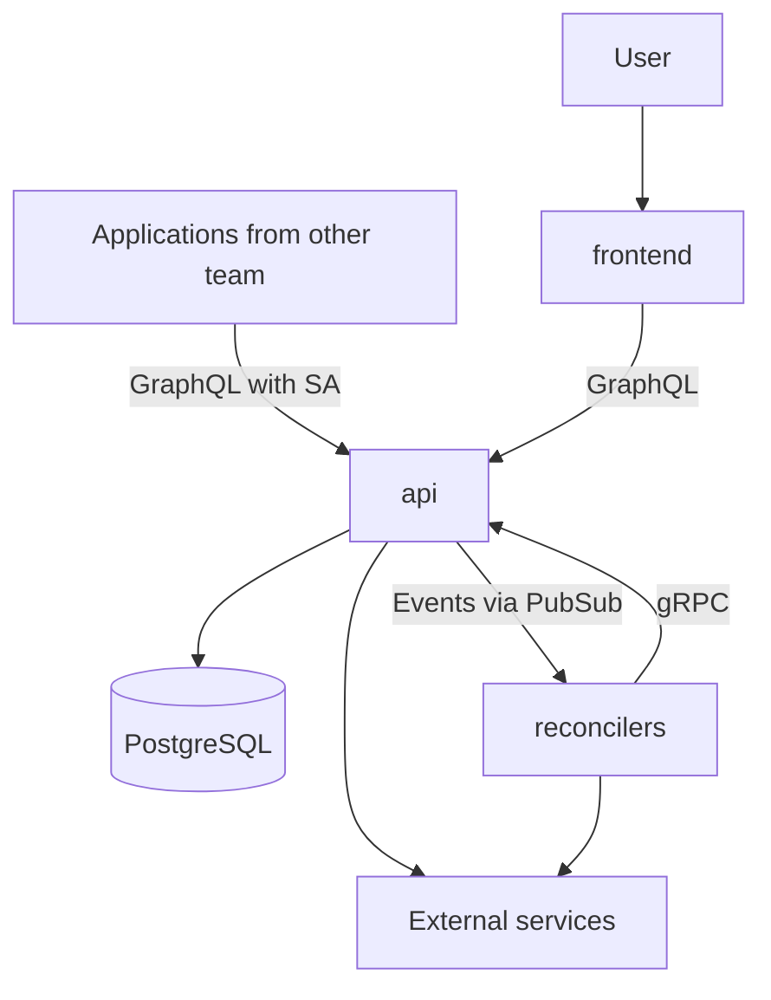

# Dapla Ctrl

Monorepo for applications powering <https://dapla-ctrl.intern.ssb.no/>.

The project provides the user interface, API, and background reconciliation services used to manage Dapla teams, permissions, and related platform resources.

## Repository overview

This repository is split into separate applications. Each directory contains its own README with more details.

| Directory | Short description |
| --- | --- |
| [`frontend/`](frontend/README.md) | The web interface of Dapla Ctrl. Built with SvelteKit and talks to the API over GraphQL. |
| [`api/`](api/README.md) | The Dapla API. Provides a GraphQL API, and a gRPC API used by internal services. Stores application state in a database. |
| [`reconcilers/`](reconcilers/README.md) | Background workers that keep external resources in sync with the desired state stored in the API. |

```mermaid
graph TD
    User[User] --> Frontend[frontend]
    App[Applications from other team] --> |GraphQL with SA| API
    
    Frontend -->|GraphQL| API[api]
    
    API --> Postgres[(PostgreSQL)]
    API --> |Events via PubSub| Reconcilers[reconcilers]
    API --> External[External services]
    
    Reconcilers -->|gRPC| API
    Reconcilers --> External
```

## Technology

The main technologies used in this repository are:

- **Go** for the API and reconcilers
- **GraphQL** for the public/client API
- **gRPC** for internal service communication
- **PostgreSQL** for persistent API state
- **SvelteKit**, **TypeScript**, and **pnpm** for the frontend
- **Google Pub/Sub** for event-driven reconciliation
- **Nais** for deployment

## Development

In short summary, the applications have separate tooling and setup requirements:

- Go services use `mise`, `make`, and local environment files.
- The frontend uses `pnpm` and Vite/SvelteKit tooling.

See the README for each component for more details.