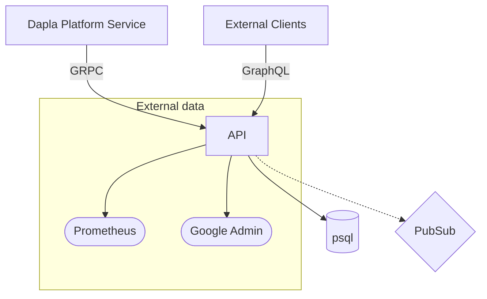

# Dapla API

Dapla API is the main application used for managing Dapla Teams.

It is a fork of and therefore also heavily inspired by [Nais API](https://github.com/nais/api)

## Local development

As a pre-requisite, you need a container runtime available, such as [Rancher](https://ranchermanager.docs.rancher.com/getting-started/installation-and-upgrade) or [Colima](https://github.com/abiosoft/colima?tab=readme-ov-file#installation). You might also need to install [mise](https://mise.jdx.dev/installing-mise.html) and [Docker Engine](https://docs.docker.com/engine/install/) if you haven't already.

```bash
mise install # Install required dependencies
cp .env.example .env # Copy example configuration file, and adjust to your needs
docker compose up -d
make setup-local # Setup local environment (seeds database and creates pubsub topic)
make local
```

For local development various services are faked.
This is controlled by multiple `WITH_*` environment variables in the `.env` file.
If `WITH_INSECURE_USER_HEADER` is set, you will also need to set the `X-User-Email` header to `dev.usersen@example.com` if you want
to act as a regular user, or `admin.usersen@example.com` if you need an admin user, when interacting with the GraphQL API.

Locally, most external services are replaced with fake clients, and the Kubernetes client reads data from `data/k8s`.

The test suite uses [testcontainers](https://testcontainers.com/), and if you are using Colima you might need to follow
the guidelines in the [testcontainers documentation](https://golang.testcontainers.org/system_requirements/using_colima/).

## Development practices

Check practices used in this project here: [docs/practices.md](docs/practices.md)

### Graph-API

We have defined a set of practices for the Graph-API in the [docs/graphql_practices.md](docs/graphql_practices.md) file.

## Fake clients

We have a set of fake clients, and stubs, that can be used for local development.

## Integration tests

We are using [tester](https://github.com/nais/tester) for integration tests.
These tests are written in Lua and can be found in the `integration_tests` directory.

A spec file is generated to support auto-completion using the Lua language server.

When running `make test` the integration tests will be run as part of the test suite.
If you only want to run the integration tests, and get information about coverage, you can run `make integration-test`.

To run the integration tests in watch mode, run `make integration_test_ui`.
This will start a web server on `localhost:9876` where you can see the test results.
They will be re-run every time you save a `.lua` file.

## Architecture


```mermaid

graph TD
  API --> Postgres[(psql)]
  Service[Dapla Platform Service] --> |GRPC|API
  Clients[External Clients] --> |GraphQL|API
  API -.-> PubSub{PubSub}

  subgraph ext [External data]
    API --> Prom([Prometheus])
    API --> GA([Google Admin])
  end
```

| Component        | Description                                                                                |
| ---------------- | ------------------------------------------------------------------------------------------ |
| API              | This service                                                                               |
| Postgres         | The postgres database storing state from this application                                  |
| Nais Service     | Services by Nais that requires special communication with API. E.g. Reconcilers and Deploy |
| External Clients | External clients that communicates with the API. E.g. Browsers and NADA                    |
| PubSub           | The PubSub topic used for communication between the API and the Nais Service               |
| Prometheus       | We collect historic data from the tenants prometheus                                       |
| Google Admin     | We use the Google Admin API to manage a list of users                                      |

## Code generated by GitHub Copilot

This repository uses GitHub Copilot to generate code.

## Deploy

Deploys are performed with a manually triggered GitHub Actions workflow. When you trigger the workflow you must provide the image version/tag.

Triggering can be done in GUI or from the command line:

```sh
gh workflow run deploy.yaml --ref main --field image_version=1.2.3
```
